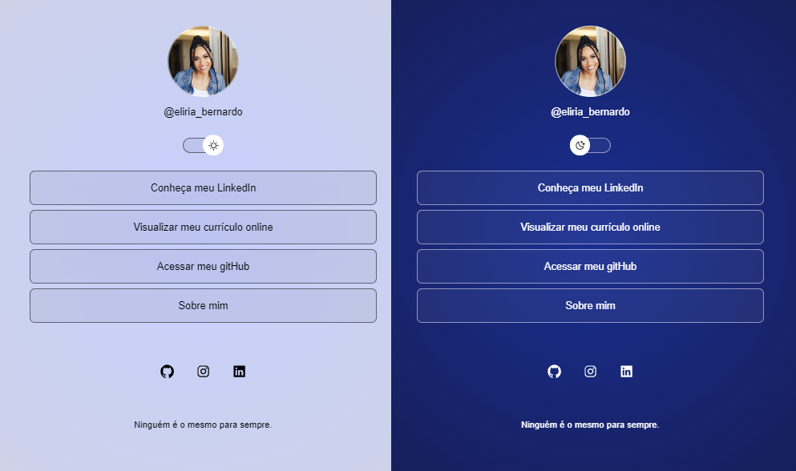

<h1 align="center"> Presentation links </h1>

Este é um projeto de uma página que mostra uma maneira de reunir informações pessoais importantes e apresentá-las em um só lugar, trazendo links de lugares importantes como Instagram, LinkedIn e Github.

  <a href="#-tecnologias">Tecnologias</a>&nbsp;&nbsp;&nbsp;|&nbsp;&nbsp;&nbsp;
  <a href="#-projeto">Projeto</a>&nbsp;&nbsp;&nbsp;|&nbsp;&nbsp;&nbsp;
  <a href="#-layout">Layout</a>&nbsp;&nbsp;&nbsp;|&nbsp;&nbsp;&nbsp;
  <a href="#memo-licença">Licença</a>

  

 

  

## 🚀 Tecnologias

Esse projeto foi desenvolvido com as seguintes tecnologias:

- HTML e CSS
- JavaScript
- Git e Github
- Figma

## 💻 Projeto

Os links de apresentação foram desenvolvidos a partir do Discover, um curso gratuito da Rocketseat. 

## 🔖 Layout

Você pode visualizar o layout do projeto através [DESSE LINK](https://www.figma.com/community/file/1187422022288947321/devlinks-projeto-discover). É necessário ter conta no [Figma](https://figma.com) para acessá-lo.

## :memo: Licença

Licença by MIT.

---

Rocketseat: [Participe da nossa comunidade!](https://discord.gg/rocketseat)